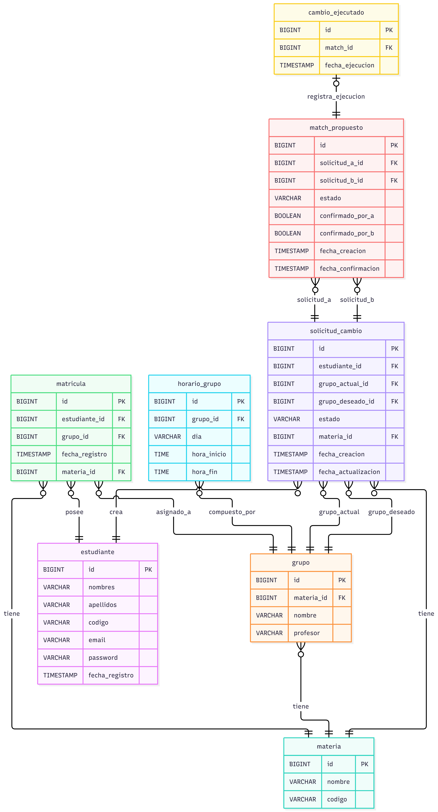
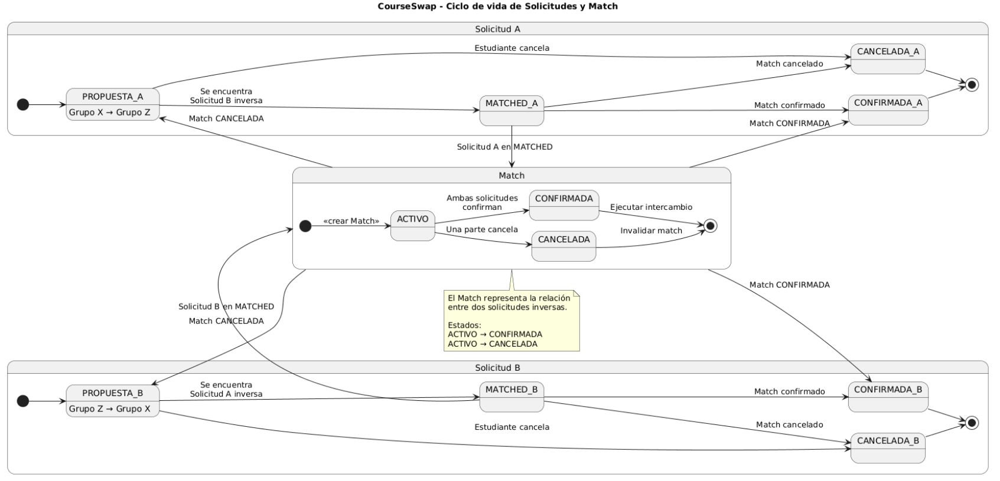
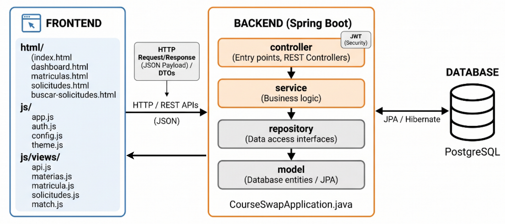
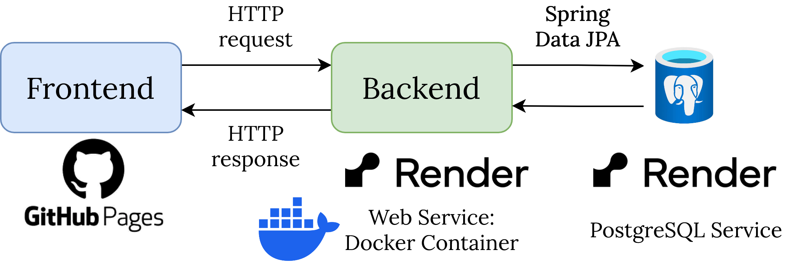
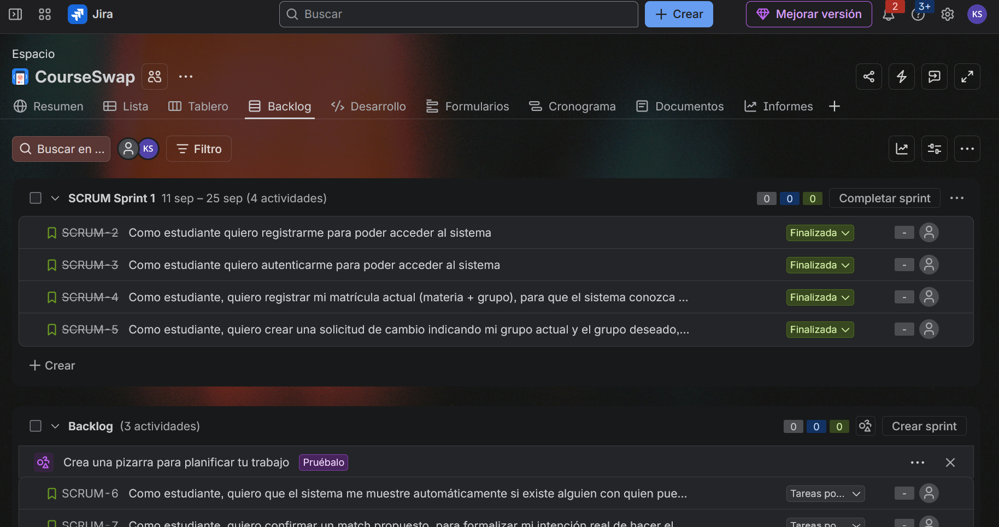

# CourseSwap
CourseSwap es una aplicación web para estudiantes de la Universidad Industrial de
Santander (UIS) que necesitan cambiarse de grupo en una materia. El sistema
conecta a estudiantes con necesidades de intercambio compatibles y evita que el
cambio se ejecute hasta que las dos personas lo confirmen.

## Integrantes 
Entornos de Programacion F1 2026-2
- Alejandro Castro Rondon - 2230045
- Jonk Keyler sanchez pabon - 2221551
- Juan Carlos Elizalde Padilla - 2230028

## Despliegue
- Enlace Backend desplegado: [https://courseswap.onrender.com/swagger-ui/index.html](https://courseswap.onrender.com/swagger-ui/index.html)
- Enlace Frontend desplegado: [https://jonkkeyler333.github.io/CourseSwap/](https://jonkkeyler333.github.io/CourseSwap/)

## JWT
La consulta y detalles de implementación de JWT se encuentran en el siguiente reporte: [JWT Implementation Report](./media/Investigacion_JWT.pdf)

## Motivación y problema que resuelve

Cambiarse de grupo puede ser necesario cuando el horario de un estudiante deja
de ser conveniente, pero encontrar a otra persona que quiera hacer el
intercambio inverso suele requerir búsquedas manuales y coordinación por fuera
de la plataforma. CourseSwap centraliza ese proceso:

1. El estudiante consulta sus materias y grupos.
2. Publica el grupo actual y el grupo al que desea cambiarse.
3. El sistema busca una coincidencia inversa o permite aceptar una solicitud
   compatible.
4. Las dos partes confirman el match.
5. El backend intercambia los grupos de las matrículas y registra el cambio.

Las validaciones del backend comprueban, entre otros aspectos, que la materia y
los grupos correspondan, que el estudiante tenga la matrícula necesaria y que
el grupo deseado no produzca conflictos de horario. El intercambio se realiza
sobre las matrículas almacenadas en CourseSwap; no es una integración directa
con un sistema académico externo de la UIS.

## Modelo de base de datos
El modelo de base de datos que muestra las entidades y relaciones es el siguiente:


## Diagrama de estados
El siguiente diagrama de estados y transiciones, muestra el flujo que siguen los estados tanto de las solicitudes como de los matches propuestos, desde la creación de la solicitud hasta la ejecución del cambio:


## Requisitos funcionales y estado

| Requisito | Estado actual | Descripción |
| --- | --- | --- |
| Registro de estudiantes | **Implementado** | Registro con nombre, apellido, código, correo y contraseña; validación y hash con BCrypt. |
| Inicio de sesión | **Implementado** | Autenticación con Spring Security y JWT con expiración configurada. |
| Consulta del perfil autenticado | **Implementado** | Recuperación del estudiante actual mediante `GET /api/estudiantes/me`. |
| Consulta de materias, grupos y horarios | **Implementado** | La API ofrece búsquedas y horarios; el frontend consume materias para crear solicitudes. |
| Consulta de matrículas | **Implementado** | La API permite consultar las matrículas del estudiante y la UI muestra los resultados. |
| Creación de matrículas | **Implementado** | El sistema permite crear una matrícula desde la interfaz. |
| Creación, edición y cancelación de solicitudes | **Implementado** | El estudiante gestiona sus solicitudes y sus estados. |
| Validación de conflictos de horario | **Implementado** | Se valida al crear una solicitud y al aceptar una coincidencia manual. |
| Matching automático | **Implementado** | Detecta solicitudes inversas para la misma materia y crea un match. |
| Búsqueda y matching manual | **Implementado** | Permite consultar solicitudes compatibles y aceptarlas desde la interfaz. |
| Confirmación bilateral del intercambio | **Implementado** | Cada participante confirma o cancela el match. |
| Ejecución e historial del intercambio | **Implementado** | Al confirmar ambas partes se intercambian los grupos y se registra `CambioEjecutado`. |
| Tema claro/oscuro y guard de sesión | **Implementado** | Preferencia persistida en `localStorage` y redirección ante sesiones no autenticadas. |

## Tecnologías empleadas

### Backend

- Java 21.
- Spring Boot 4.1.1.
- Spring Web MVC para la API REST.
- Spring Data JPA y Hibernate para persistencia.
- Spring Security y JWT (JJWT 0.12.7) para autenticación stateless.
- Bean Validation para validar solicitudes.
- PostgreSQL 16.
- Lombok.
- Springdoc OpenAPI 2.8.9 para Swagger/OpenAPI.
- Maven Wrapper para compilación y ejecución.

### Frontend

- HTML5 y Bootstrap 5.3.2 mediante CDN.
- JavaScript moderno con ES Modules.
- Fetch API para comunicarse con el backend.
- `localStorage` para token, usuario y preferencia de tema.
- No utiliza framework frontend, TypeScript, bundler ni `package.json`.

### Despliegue

- Render para el backend mednainte un contenedor que realiza el build de Maven y ejecuta la aplicación.
- Render para la base de datos PostgreSQL.
- GitHub Pages para el frontend mediante un github action que deploya la aplicación.

## Arquitectura

### Backend: API REST monolítica por capas

El backend sigue una arquitectura clásica de API REST con separación por
responsabilidades como se muestra en la siguiente figura:



- **Controllers:** reciben requests, validan DTOs y delegan la operación.
- **Services:** concentran reglas como compatibilidad, conflictos de horario,
  estados y confirmación bilateral.
- **Repositories:** encapsulan consultas JPA sobre estudiantes, materias,
  grupos, matrículas, solicitudes y matches.
- **DTOs:** separan el contrato de la API de las entidades persistentes.
- **Security:** un filtro JWT protege los recursos; el backend trabaja sin
  sesión HTTP.
- **Exception handler:** un manejador global transforma errores de validación y
  negocio en respuestas consistentes.

Las entidades principales son `Estudiante`, `Materia`, `Grupo`, `HorarioGrupo`,
`Matricula`, `SolicitudCambio`, `MatchPropuesto` y `CambioEjecutado`.

### Despliegue
En la siguiente figura se detalla los servicios desplegados y la comunicación entre ellos:


### Frontend: Multi-Page Application modular orientada a vistas

El frontend adopta un estilo particularmente interesante: no es una SPA
tradicional ni depende de un framework. Es una **Multi-Page Application (MPA)**
estática, con módulos ES6 y controladores de vista imperativos:

```text
HTML independiente
    |
    v
app.js detecta IDs del DOM
    |
    v
View module -> Service module -> fetchAPI -> API REST
    |                    |
    v                    v
manipulación DOM     localStorage (JWT/usuario/tema)
```

Cada página (`index.html`, `dashboard.html`, `solicitudes.html`,
`buscar-solicitudes.html` y `matriculas.html`) carga el mismo punto de entrada,
`frontend/js/app.js`. Ese módulo detecta la página mediante IDs del DOM e
inicializa la vista correspondiente.

La organización modular separa:

- `js/views/`: controladores de cada pantalla, listeners, renderizado y estados
  vacíos.
- `js/auth.js`, `solicitudes.js`, `match.js`, `materias.js` y `matricula.js`:
  servicios de dominio que encapsulan las llamadas HTTP.
- `js/api.js`: cliente común que agrega el JWT, interpreta errores y redirige
  ante un `401`.
- `js/theme.js`: persistencia y cambio del tema claro/oscuro.

Este enfoque reduce la infraestructura y mantiene responsabilidades claras,
aunque requiere conectar manualmente cada vista con sus servicios y no ofrece
un router o un estado global reactivo como una SPA.

## Estructura del proyecto

```text
CourseSwap/
├── course-swap/                 # API Spring Boot
│   ├── src/main/java/.../
│   │   ├── controller/
│   │   ├── dto/
│   │   ├── model/
│   │   ├── repository/
│   │   ├── security/
│   │   └── service/
│   ├── src/main/resources/
│   └── pom.xml
├── frontend/                    # MPA estática y módulos ES6
├── docker-compose.yml           # PostgreSQL local
└── README.md
```
## JIRA
El proyecto se gestiona con JIRA, donde se registran historias de usuario, tareas y bugs. Como se muestra en la siguiente figura, se creó un tablero para gestionar las historias de usuario y su progreso : 



## Puesta en marcha local

### Requisitos previos

- Java 21.
- Docker y Docker Compose.
- Un navegador moderno.
- Un servidor HTTP estático para servir `frontend/` (los módulos ES6 no deben
  abrirse directamente con `file://`).

### Backend y base de datos

1. Levantar PostgreSQL:

   ```bash
   docker compose up -d db
   ```

2. Desde `course-swap/`, ejecutar la API:

   ```powershell
   .\mvnw.cmd spring-boot:run
   ```

   En Linux/macOS:

   ```bash
   ./mvnw spring-boot:run
   ```

3. La API queda disponible en `http://localhost:8080/api`. La documentación
   OpenAPI/Swagger está disponible en `/swagger-ui.html` cuando la aplicación
   está en ejecución.

La configuración local de PostgreSQL se encuentra en
`course-swap/src/main/resources/application.properties`. No se deben publicar
credenciales reales ni reutilizar el secreto JWT de desarrollo en otros
entornos.

### Frontend

Con el backend activo, servir la carpeta `frontend/` con cualquier servidor
HTTP estático y abrir `index.html`. Por ejemplo:

```text
http://localhost:<puerto>/index.html
```

La URL base del backend está definida actualmente en
`frontend/js/config.js` como `http://localhost:8080/api`.

## API principal

Los endpoints protegidos requieren el header:

```text
Authorization: Bearer <jwt>
```

| Área | Operaciones principales |
| --- | --- |
| Autenticación | `POST /api/auth/register`, `POST /api/auth/login` |
| Estudiante | `GET /api/estudiantes/me`, `GET /api/estudiantes/{id}/matriculas`, `GET /api/estudiantes/{id}/solicitudes` |
| Materias y grupos | `GET /api/materias`, `GET /api/materias/horario`, `GET /api/grupos` |
| Matrículas | `POST /api/matriculas/`, `GET /api/matriculas/{id}` |
| Solicitudes | `GET/POST /api/solicitudes/`, `PUT /api/solicitudes/`, `DELETE /api/solicitudes/{id}`, `GET /api/solicitudes/buscar` |
| Matching | `POST /api/solicitudes/{id}/match-manual`, `GET /api/match/me`, `POST /api/match/{id}/confirm`, `POST /api/match/{id}/cancel` |